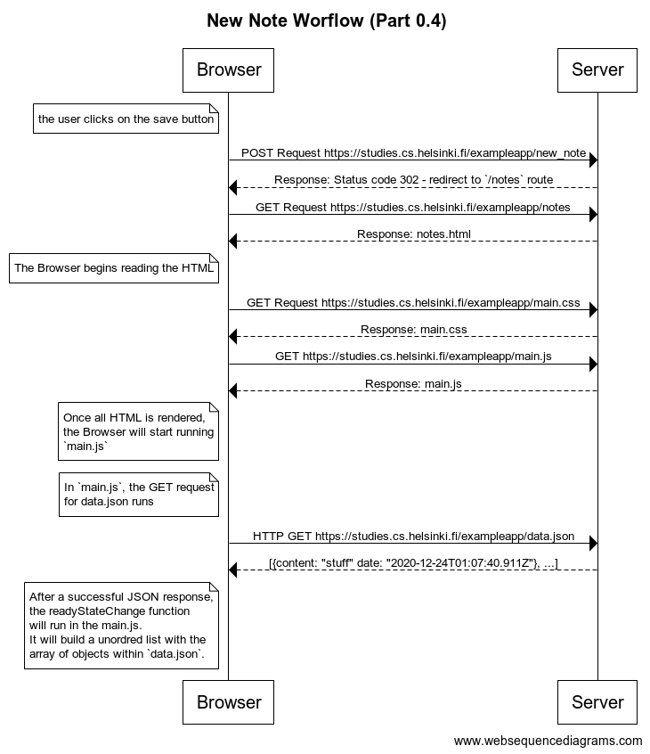
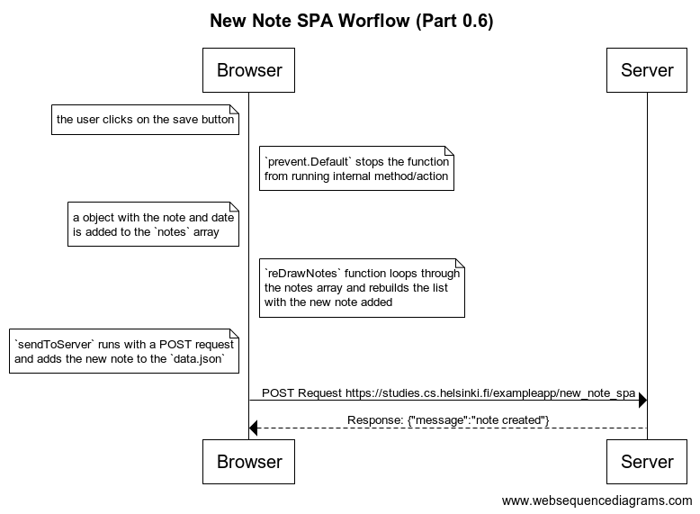

# Part 0-B:  Fundamentals of Web apps


## Table Of Contents

- [Part 0-B:  Fundamentals of Web apps](#part-0-b--fundamentals-of-web-apps)
  - [Table Of Contents](#table-of-contents)
    - [HTTP GET](#http-get)
    - [Application logic to run in a browser](#application-logic-to-run-in-a-browser)
    - [Document Object Model or DOM](#document-object-model-or-dom)
    - [Summary](#summary)


### HTTP GET

```
Browser                                               Example App Server
->----HTTP GET Request https://studies.cs.helsinki.fi/exampleapp/------->
                                                                        |
<--------<-------------Response: HTML FILE----<-------------<-----------V
|
V->HTTP GET Request https://studies.cs.helsinki.fi/exampleapp/kuva.png-->
                                                                        |
<--------<-------------Response: kuva.png-------<-----------<-----------V
```

### Application logic to run in a browser

I have added notes that show my understanding about what is being run in main.js 

```javascript
// Create a new Request Object
var xhttp = new XMLHttpRequest()

// Once the page is ready, run this function
xhttp.onreadystatechange = function() {
  // When the request returns a successful response
  if (this.readyState == 4 && this.status == 200) {
    // parse this JSON into a readable object 
    const data = JSON.parse(this.responseText)
    // log the readable object in the console
    console.log(data)

    // Create a <ul> element
    var ul = document.createElement('ul')
    // add the class of notes to the <ul>
    ul.setAttribute('class', 'notes')

    // loop through the array of objects in the data variable
    data.forEach(function(note) {
      // create a new <li> element
      var li = document.createElement('li')

      // add the current li to the bottom of the <ul> element
      ul.appendChild(li)
      // Add to the note to the text of the current <li>
      li.appendChild(document.createTextNode(note.content))
    })

    // add the ul to the #notes (id) element
    document.getElementById('notes').appendChild(ul)
  }
}

// setup a GET request for the file data.json
xhttp.open('GET', '/data.json', true)

// Send the request
xhttp.send()
```

### Document Object Model or DOM

Simple DOM representation fo the notes.html page

```
html
  head
    link
    script
  body
    div
      h1
      div
        ul
          li
          li
          li
          li
          li
          li
          li
          li
          li
          li
      form
        input
        input
```

The following  can be added to the console. It creates a new li-element and add appropriate text content. Then it adds a li element to the list:
```javascript
const list = document.getElementsByTagName('ul')[0];
let newElement = document.createElement('li');
newElement.textContent = 'Page manipulation from console is easy';
list.appendChild(newElement)
```

### Summary

It seems like they are trying to drive home the fact that single-page applications do a lot of server-side functionality (routing, data collection, etc.) on the client-side(front-end). You can see the difference with both exercise 0.4 and 0.6.



**Notice the redirect causes the HTML, CSS, and JavaScript files are all downloaded again and rendered.**




**Now we are just adding it to the page immediately, then posting the new note in the server in case the user refreshes the page.**