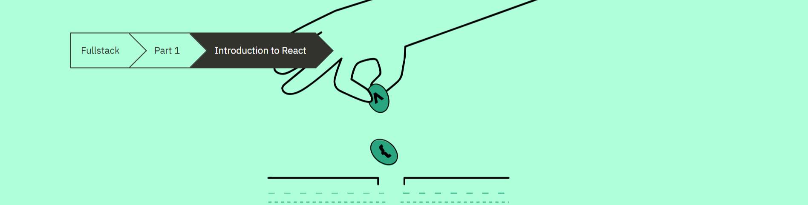

# Part 1-A: Introduction to React



## Table of Contents
- [Part 1-A: Introduction to React](#part-1-a-introduction-to-react)
  - [Table of Contents](#table-of-contents)
  - [1. React Setup](#1-react-setup)
  - [2. React Component and JSX](#2-react-component-and-jsx)
    - [2a. Components](#2a-components)
    - [2b. JSX](#2b-jsx)
  - [3. Multiple Elements](#3-multiple-elements)
  - [4. Props](#4-props)
  - [5. Notes on React](#5-notes-on-react)
  - [6. Summary](#6-summary)
  - [7. Additional Resources](#7-additional-resources)


## 1. React Setup

Using `create-react-app` is the easiest way to get started. Run the following commands in your terminal (Bash/Zsh) to get started:

```bash
# Don't forget to replace `dirName` with the 
# name you would like it to be.
npx create-react-app dirName
# cd (change directories) to `dirName` (or whatever 
# name you replaced it with)
cd dirName
# check npm scripts and find one called `start`
# this will be in the `scripts` section of your
# package.json
npm start
```

**Note**: after  you run `npm start` your chrome browser open automatically to `http://localhost:3000`

**Note**: for the following examples we have removed the following files from the `src` folder:

* App.js
* App.css
* App.test.js
* logo.svg
* setupTests.js
* reportWebVitals.js

This means the only file in the `src` folder is:

* index.js
* index.css

## 2. React Component and JSX


### 2a. Components

We replace the current content of `index.js` with the following:

```js
import React from 'react';
import ReactDOM from 'react-dom';


const App = () => {
  // Since this is a JavaScript function, we can create variables (let, const) and normal JavaScript stuff.
  const now = new Date();
  const a = 10;
  const b = 20;
  const getDateString = (date) => {
    return date.toString();
  }

  return (
    <div>
      {/* This is how you comment within JSX */}
      {/* It seems like React components are returning HTML markup. The are not. This is an example of JSX */}
      {/* We can also incorporate the function variables into JSX elements */}
      {/* As long as we nest JavaScript within curly braces - {} - see the examples below */}
      <p>Hello world, it is {getDateString(now)}</p>
      <p>
        {a} plus {b} is {a + b}
      </p>
    </div>
  );
}

// Use the App component, then go to `public/index.html`, and find the HTML element with the id of `root`
ReactDOM.render(<App />, document.getElementById('root'));
```
`create-react-app` uses [Babel](https://babeljs.io/repl/) to handle compiling JSX into something the browser can use. Below is what Babel will return after compiling:

```js
import React from 'react';
import ReactDOM from 'react-dom';

const App = () => {
  const now = new Date();
  const a = 10;
  const b = 20;
  const getDateString = (date) => {
    return date.toString();
  }

  return React.createElement(
    'div',
    null,
    React.createElement(
      'p', null, 'Hello world, it is ', getDateString(now)
    ),
    React.createElement(
      'p', null, a, ' plus ', b, ' is ', a + b
    )
  );
}

ReactDOM.render(
  React.createElement(App, null),
  document.getElementById('root')
);

```
### 2b. JSX

**Note**: JSX is XML-like, which means that every tag needs to be closed. So if you have a component like:

```js
// Incorrect
<App>
```

You will have to make sure to add a / to close the element

```js
// Correct
<App />
```

## 3. Multiple Elements

 **Note:** A core philosophy of React is composing applications from many specialized reusable components.

 **Note:** Here is a very example of a reusable component

 ```js
import React from 'react';
import ReactDOM from 'react-dom';

const Hello = () => {
  return (
    <div>
      <p>Hello world</p>
    </div>
  );
}

const App = () => {
  return (
    <div>
      <h1>Greetings</h1>
      {/* We will build on this example in the next section so you can see how */}
      {/* you can make React components more reusable with props*/}
      <Hello />
      <Hello />
      <Hello />
    </div>
  );
}

ReactDOM.render(<App />, document.getElementById('root'));
 ```

## 4. Props

We can use [React props](https://reactjs.org/docs/components-and-props.html) to pass data to components. Here is an example using the `Hello` component from the previous section:

```js
import React from 'react';
import ReactDOM from 'react-dom';

// Props object is passed as a parameter
const Hello = (props) => {
  return (
    <div>
      <p>
        {/* This line will go to the component */}
        {/* and look for the properties `name` and `age` */}
        {/* the value will be returned within the parenthesis */}
        Hello {props.name}, you are {props.age} years old
      </p>
    </div>
  )
}

const App = () => {
  const name = 'Peter'
  const age = 10

  return (
    <div>
      <h1>Greetings</h1>
      {/* The components below will return the following: */}
      <Hello name="Maya" age={26 + 10} />
      {/* Hello Maya, you are 36 years old */}
      <Hello name={name} age={age} />
      {/* Hello Peter, you are 10 years old */}
    </div>
  )
}

```

## 5. Notes on React

Here are some helpful notes on React:

* When on the browser, your console should be open at all times.
* If something is not working correctly, it would be wise to `console.log()` to confirm data is being passed correctly and/or functions are working as expected.
* **IMPORTANT NOTE:** **React component names must be capitalized**!
```js
// incorrect
<footer />

// correct
<Footer />
```
* React components need to contain only one root element:

```js
// Incorrect
// This would return the following error message:
// Parsing error: Adjacent JSX elements must
const App = () => {
  return (
    <h1>Greetings</h1>
    <Hello name="Maya" age={26 + 10} />
    <Footer />
  )
}

```

We can use a [React fragment](https://reactjs.org/docs/fragments.html) that we can the elements without having to add another unnecessary <div>:

```js
// Correct
const App = () => {
  const name = 'Peter'
  const age = 10

  return (
    <>
      <h1>Greetings</h1>
      <Hello name="Maya" age={26 + 10} />
      <Hello name={name} age={age} />
      <Footer />
    </>
  )
}
```

**Note:** `<> </>` are shorthand for `React.Fragment`
**Note:** `import React from 'react';` needs to be included in the file to access fragments
**Note**: Since JSX is closer to JavaScript than to HTML, React DOM uses camelCase property naming convention instead of HTML attribute names. For example, the attribute `class` becomes `className` in JSX, and `tabindex` becomes `tabIndex`.

## 6. Summary

A core philosophy of React is composing applications from many specialized reusable components. It is common to use functions for React component that accepts a single “props” (which stands for properties) object argument with data and returns JSX (JavaScript XML).

## 7. Additional Resources

* [React Tutorial: An Overview and Walkthrough - Tania Rascia](https://www.taniarascia.com/getting-started-with-react/)
* [Reactjs.org - Tutorial: Intro to React](https://reactjs.org/tutorial/tutorial.html)
* [Official React Documentation](https://reactjs.org/docs/getting-started.html)