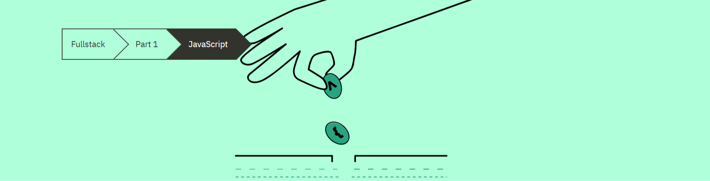

# Part 1-B: JavaScript



## Table of Contents
- [Part 1-B: JavaScript](#part-1-b-javascript)
  - [Table of Contents](#table-of-contents)
  - [1. Variables](#1-variables)
    - [1a. Const and Let](#1a-const-and-let)
  - [2. Arrays](#2-arrays)
    - [2a. Array Methods](#2a-array-methods)
    - [2b. Array Destructuring](#2b-array-destructuring)
  - [3. Objects](#3-objects)
  - [4. Arrow Functions](#4-arrow-functions)
  - [5. Summary](#5-summary)
  - [6. Additional Resources](#6-additional-resources)
    - [6a. Links from Full Stack Course](#6a-links-from-full-stack-course)
    - [6b. MDN Links From Notes](#6b-mdn-links-from-notes)

## 1. Variables

Here is some examples of declaring variables:

```js
const x = 1;
let y = 5;

console.log(x, y); // prints 1, 5
y += 10;
console.log(x, y); // prints 1, 15
y = 'sometext';
console.log(x, y); // prints 1, sometext
x = 4; // causes an error
```

### 1a. Const and Let

* [const](https://developer.mozilla.org/en-US/docs/Web/JavaScript/Reference/Statements/const) does not actually define a variable but a constant for which the value can no longer be changed.

* [let](https://developer.mozilla.org/en-US/docs/Web/JavaScript/Reference/Statements/let) defines a normal variable.

## 2. Arrays

More details on [arrays can be found here](https://developer.mozilla.org/en-US/docs/Web/JavaScript/Reference/Global_Objects/Array)

Here is a simple visual example of arrays in use:

```js
const nums = [1, -1, 3];

const newNums = nums.concat(5);

console.log(nums.length); // prints 3
console.log(nums[1]);     // prints -1 
console.log(nums);        // prints [1, -1, 3] 
console.log(newNums);     // prints [1, -1, 3, 5]
```

**Note on array manipulation:** It is preferable to create a new variable and use the `concat` array method instead of the `push` array method. See the example below:

```js
// Incorrect
const exampleOne = [1, -1, 3];
exampleOne.push(5);
console.log(exampleOne); // prints [1, -1, 3, 5]

// Correct
const numbers = [1, -1, 3];

const newNumbers = t.concat(5);

console.log(numbers);  // prints [1, -1, 3]
console.log(newNumbers); // prints [1, -1, 3, 5]

```

### 2a. Array Methods

 In the same spirit, we can use array methods like [map](https://developer.mozilla.org/en-US/docs/Web/JavaScript/Reference/Global_Objects/Array/map), [filter](https://developer.mozilla.org/en-US/docs/Web/JavaScript/Reference/Global_Objects/Array/filter), and [reduce](https://developer.mozilla.org/en-US/docs/Web/JavaScript/Reference/Global_Objects/Array/Reduce). Let us take a look at a few examples of map:

```js
// Example 1
const numbers = [1, 2, 3];
/* map creates a array copy based of `numbers`, then uses the 
*  callback function in the 1st argument of map on each 
*  element in the copied array so in this example,
*  each element of the array is being multiplied by 2 
*  and then returned to the copy */
const numbersMultipliedBy2 = numbers.map(value => value * 2);
console.log(numbersMultipliedBy2); // prints [2, 4, 6]

// Example 2
// We adding to the beginning of the array value the string `<li>`
// Then we are appending the array value with the string `</li>` 

// the commented out variable below is from the ES5 practice of string concatenation */
// const listValuesES5 = t.map(value => '<li>' + value + '</li>')
// let us be consistent with ES6 practices and us template literals 

const listValues = t.map(value => `<li>${value}</li>`);
console.log(listValues); // prints ['<li>1</li>', '<li>2</li>', '<li>3</li>']
```

[Learn more about template literals here](https://developer.mozilla.org/en-US/docs/Web/JavaScript/Reference/Template_literals)

### 2b. Array Destructuring

We can break the array into single elements or section of arrays by the [destructuring assignment](https://developer.mozilla.org/en-US/docs/Web/JavaScript/Reference/Operators/Destructuring_assignment). Let us see an example

```js
const arrOfNums = [1, 2, 3, 4, 5];

// first and second will just represent the first 2 values in the array.
// We use the spread operator to assign the remaining values of `arrOfNums` to `rest`
// which is an array.
const [first, second, ...rest] = arrOfNums;

console.log(first, second);  // prints 1, 2 
console.log(rest);          // prints [3, 4 ,5]
```

## 3. Objects

The common way to declare objects is by using [object literals](https://developer.mozilla.org/en-US/docs/Web/JavaScript/Guide/Grammar_and_types#object_literals). Let's look at some examples:

```js
// Objects values can be any value type
// numbers, strings, array, objects, functions, booleans
// object properties (keys) are on the left hand side of the colon
// object values are on the right hand side of the colon
// key: value
const object1 = {
  name: 'Arto Hellas',
  age: 35,
  education: 'PhD',
}

const object2 = {
  name: 'Full Stack web application development',
  level: 'intermediate studies',
  size: 5,
}

const object3 = {
  name: {
    first: 'Dan',
    last: 'Abramov',
  },
  grades: [2, 3, 5, 3],
  department: 'Stanford University',
}

// If you want to access a property (key) on an object

// You can use dot notation
console.log(object1.name); // prints 'Arto Hellas'
// If you have the object key stored as a variable
// Or if your key has a space in the name
//you can use the bracket notation
const fieldName = 'age';
console.log(object1[fieldName]); // prints 35

// You can also add object keys with dot or bracket notation
object1.address = 'Helsinki';
object1['secret number'] = 12341;
console.log(object1.address); // prints 'Helsinki'
```

## 4. Arrow Functions

Since we are using ES6 conventions, we will be using [Arrow function expressions](https://developer.mozilla.org/en-US/docs/Web/JavaScript/Reference/Functions/Arrow_functions). Let's see a few examples:

```js
// This runs the same as 
// function sum(p1, p2) {...
const sum = (p1, p2) => {
  console.log(p1, p2);
  return p1 + p2;
}

const result = sum(1, 5); // prints 1 5 
console.log(result)       // prints 6

// if there is just 1 parameter for the arrow function
// we can remove the parenthesis
const square = p => {
  console.log(p)
  return p * p
}

/* In fact, since we are only really returning one line
*  we can remove the console.log and curly braces
* to make this a single line expression */

// `square` and `square2` will return the same results 
// if given the same argument
const square2 = p => p * p

// a common use of single line expression can be seen when
// using array methods like map and filter
const nums = [1, 2, 3]
const numsSquared = nums.map(p => p * p)
console.log(numsSquared); // prints [1, 4, 9]
```

**Pro-tip:** If you are running into unexpected issues with your component props, log them to the console like so

```js
const Header = (props) => {
  console.log(props);  
  return <h1>{props.course}</h1>;
}
```

**Note:** There is additional section on `Object methods and "this"` and `Classes`. Since we are mainly focused on functional components, I have decided to skip taking notes for this section. If I have time to come back around, I will add them here.

## 5. Summary

Current React standards (as of 2021) seem to heavily rely on ES6 standards. If you are not comfortable with ES6 features like array methods or arrow functions, read the docs. Google ES6 articles. Or you can search [dev.to for ES6 articles](https://dev.to/search?q=ES6). I will leave the articles from MDN in the [Resources section](#resources) below.

## 6. Additional Resources

### 6a. Links from Full Stack Course

* [MDN - JavaScript Guide](https://developer.mozilla.org/en-US/docs/Web/JavaScript)
* [MDN - A Re-introduction to JavaScript](https://developer.mozilla.org/en-US/docs/Web/JavaScript/A_re-introduction_to_JavaScript)
* [JavaScript.info - references similar to MDN](https://javascript.info/)
* [Kyle Simpson - You Don't Know JS Yet](https://github.com/getify/You-Dont-Know-JS)

### 6b. MDN Links From Notes

* [MDN - const variable declaration](https://developer.mozilla.org/en-US/docs/Web/JavaScript/Reference/Statements/const)
* [MDN - let variable declaration](https://developer.mozilla.org/en-US/docs/Web/JavaScript/Reference/Statements/let)
* [MDN - Array](https://developer.mozilla.org/en-US/docs/Web/JavaScript/Reference/Global_Objects/Array)
* [MDN - Array .map method](https://developer.mozilla.org/en-US/docs/Web/JavaScript/Reference/Global_Objects/Array/map)
* [MDN - Array .filter method](https://developer.mozilla.org/en-US/docs/Web/JavaScript/Reference/Global_Objects/Array/filter)
* [MDN - Array .reduce method](https://developer.mozilla.org/en-US/docs/Web/JavaScript/Reference/Global_Objects/Array/Reduce)
* [MDN - template literals](https://developer.mozilla.org/en-US/docs/Web/JavaScript/Reference/Template_literals)
* [MDN - destructuring assignment](https://developer.mozilla.org/en-US/docs/Web/JavaScript/Reference/Operators/Destructuring_assignment)
* [MDN - object literals](https://developer.mozilla.org/en-US/docs/Web/JavaScript/Guide/Grammar_and_types#object_literals)
* [MDN - arrow function expressions](https://developer.mozilla.org/en-US/docs/Web/JavaScript/Reference/Functions/Arrow_functions)