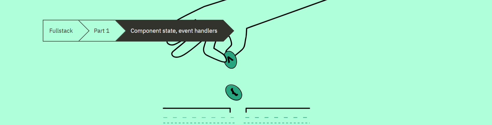
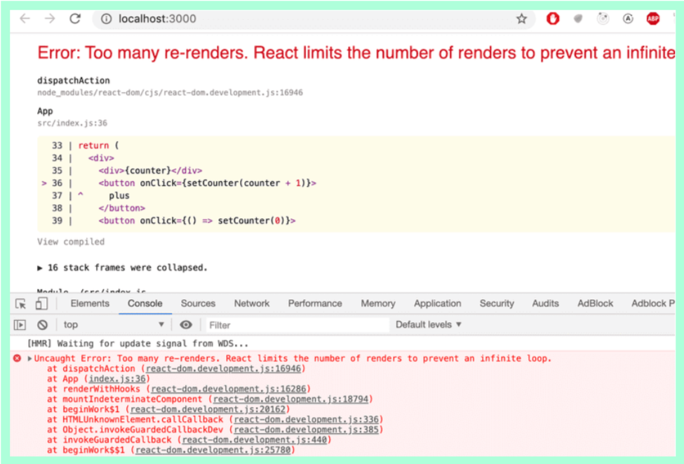

# Part 1-C:  Component state, event handlers



## Table of Contents
- [Part 1-C:  Component state, event handlers](#part-1-c--component-state-event-handlers)
  - [Table of Contents](#table-of-contents)
    - [Component Helper Functions](#component-helper-functions)
    - [Props Destructuring](#props-destructuring)
    - [Stateful Component](#stateful-component)
    - [Event Handling](#event-handling)
    - [Event Handler Is A Function](#event-handler-is-a-function)
    - [Passing state to child components](#passing-state-to-child-components)
      - [Lifting State](#lifting-state)
    - [Changes in state cause re-rendering](#changes-in-state-cause-re-rendering)
    - [Summary](#summary)
    - [Additional Resources](#additional-resources)


**Note:** We are starting with this example within `index.js`:

```js
// index.js
import React from 'react';
import ReactDOM from 'react-dom';

const Hello = (props) => {
  return (
    <div>
      <p>
        Hello {props.name}, you are {props.age} years old
      </p>
    </div>
  );
}

const App = () => {
  const name = 'Peter';
  const age = 10;

  return (
    <div>
      <h1>Greetings</h1>
      <Hello name="Maya" age={26 + 10} />
      <Hello name={name} age={age} />
    </div>
  );
}

ReactDOM.render(<App />, document.getElementById('root'));
```

### Component Helper Functions

Let's add a helper function that returns the year of birth given the user's age:

```js
import React from 'react';
import ReactDOM from 'react-dom';

const Hello = (props) => {
  // We do not need to pass props.age as a argument 
  // since it is accessible within in the Hello function
  const bornYear = () => {
    // get current year
    const yearNow = new Date().getFullYear();
    // subtract current year from props.age and return the result
    return yearNow - props.age;
  }

  return (
    <div>
      <p>
        Hello {props.name}, you are {props.age} years old
      </p>
      {/* We are calling the function within this <p> */}
      {/* Which will return the year of birth */}
      <p>So you were probably born in {bornYear()}</p>
    </div>
  );
}

const App = () => {
  const name = 'Peter';
  const age = 10;

  return (
    <div>
      <h1>Greetings</h1>
      <Hello name="Maya" age={26 + 10} />
      <Hello name={name} age={age} />
    </div>
  );
}

ReactDOM.render(<App />, document.getElementById('root'));
```

The result when you go to `http://localhost:3000` and look at the inspector you would find:

```html
<h1>Greeting</h1>
<div>
  <p>Hello Maya, you are 36 years old</p>
  <p>So you were probably born in 1985</p>
</div>
<div>
  <p>Hello Peter, you are 10 years old</p>
  <p>So you were probably born in 2011</p>
</div>

```

### Props Destructuring

We breaks objects (similar to arrays) with [object destructuring](https://developer.mozilla.org/en-US/docs/Web/JavaScript/Reference/Operators/Destructuring_assignment#object_destructuring). Lets take a look at our `Hello` component:

```js
const Hello = (props) => {
  const bornYear = () => {    
    const yearNow = new Date().getFullYear();
    return yearNow - props.age;
  }

  return (
    <div>
      <p>
        Hello {props.name}, you are {props.age} years old
      </p>
      <p>So you were probably born in {bornYear()}</p>    </div>
  );
}
```

We can destruct the props parameter and convert `bornYear` to a single line expression:

```js
// we destruct props and store the object keys as parameters
const Hello = ({name, age}) => {
  // we converted bornYear to single line expression
  const bornYear = () => new Date().getFullYear() - age;

  return (
    <div>
      <p>
        {/* Notice we remove props altogether */}
        Hello {name}, you are {age} years old
      </p>
      <p>So you were probably born in {bornYear()}</p>    </div>
  );
}
```


### Stateful Component

We will now create a new `App` example to show how we use the new [State hook](https://reactjs.org/docs/hooks-state.html). We will use state hooks to increment a counter within the component state and increment every second:

```js
// notice we destruct the useState function from
// the react library
import React, { useState } from 'react';
import ReactDOM from 'react-dom';

const App = () => {
  // we destruct the array returned from the `useState` function
  // `counter` will be where the state is stored
  // `setCounter` will be function that modifies the state
  // `useState` sets `counter` to 0
  const [ counter, setCounter ] = useState(0);
  // every 1000 ms (1 second), run the `setCounter` function
  // and add 1 to `counter`
  setTimeout(() => setCounter(counter + 1), 1000);
  // check the counter value
  console.log('rendering...', counter);
  return (
    {/* the `counter` state will be shown below*/}
    <div>{counter}</div>
  );
}

ReactDOM.render(
  <App />, 
  document.getElementById('root')
)
```

### Event Handling

**Refresher:** Event handlers are functions that run on a specific event (i.e click, onmouseover, etc). [Learn more about handling events in React here](https://reactjs.org/docs/handling-events.html). We will now convert our `App` to increment the count with a click event instead of a timed event. We will also add a button that sets the count to 0:

```js
import React, { useState } from 'react';
import ReactDOM from 'react-dom';

const App = () => {
  const [ counter, setCounter ] = useState(0);
  return (
    {/* the `counter` state will be shown below*/}
    <div>{counter}</div>
    {/* when the button is clicked, 1 is added to`counter` */}
    <button onClick={() => setCounter(counter + 1)}>plus</button>
    {/* when the button is clicked, `counter` is set to 0*/}
    <button onClick={() => setCounter(0)}>zero</button>
  );
}

ReactDOM.render(
  <App />, 
  document.getElementById('root')
);
```

### Event Handler Is A Function

Notice our onclick function for adding 1 to counter:

```js
<button onClick={() => setCounter(counter + 1)}> 
  plus
</button>
```

What if we remove the empty arrow function?

```js
<button onClick={setCounter(counter + 1)}> 
  plus
</button>
```

You would receive the error below:



Why did that happen? It is because the event handler is actually a function call. So without wrapping it in an empty arrow function, it will immediately run the `setCounter` and add 1 on infinitely.

```js
<button onClick={() => setCounter(counter + 1)}> 
  plus
</button>
```

If we wrap the `setCounter` in a function, it is called only when a user clicks the button.

Now lets move our event handlers into separate functions:

```js
import React, { useState } from 'react';
import ReactDOM from 'react-dom';

const App = () => {
  const [ counter, setCounter ] = useState(0);
  // increment moved to a declared function
  const increaseByOne = () => setCounter(counter + 1)
  // setting to 0 moved to its own function    
  const setToZero = () => setCounter(0)
  return (
    <div>{counter}</div>
    {/* This functionality will work the same as the previous examples*/}
    <button onClick={increaseByOne}>plus</button>
    <button onClick={setToZero}>zero</button>
  );
}

ReactDOM.render(
  <App />, 
  document.getElementById('root')
);
```

### Passing state to child components

Let's refactor our application so that it's composed of three smaller components, one component for displaying the counter and two components for buttons:

```js
import React, { useState } from 'react';
import ReactDOM from 'react-dom';

// displaying the value of the counter within `App` state.
const Display = ({counter}) => <div>{counter}</div>;

// handleClick will be the callback function we run when the specific button is clicked
const Button = ({handleClick, text}) => <button onClick={handleClick}>{text}</button>;

const App = () => {
  const [ counter, setCounter ] = useState(0);
  const increaseByOne = () => setCounter(counter + 1) ;
  // lets add a decrement function
  const decreaseByOne = () => setCounter(counter - 1); 
  const setToZero = () => setCounter(0);
  return (
    <Display counter={counter} />
    {/* This functionality will work the same as the previous examples*/}
    <Button handleClick={increaseByOne} text='plus' />
    <Button handleClick={decreaseByOne} text='minus' />
    <Button handleClick={setToZero} text='zero' />
  );
}
```

#### Lifting State

One best practice in React is to [lift the state up](https://reactjs.org/docs/lifting-state-up.html) in the component hierarchy. The documentation says:

```
Often, several components need to reflect the same changing data. We recommend lifting the shared state up to their closest common ancestor.
```

### Changes in state cause re-rendering

Let's go over the main principles of how an application works once more.

When the application start:

* The code in App is executed. 
* This code uses a useState hook to create the application state, setting an initial value of the variable counter. 
* `App` component contains the Display component - which displays the counter's value, 0 - and three Button components. 
* The buttons all have event handlers, which are used to change the state of the counter.

When one of the buttons is clicked

* The event handler is executed. 
* The event handler changes the state of the App component with the setCounter function. 
* Calling a function which changes the state causes the component to rerender.

So, if a user clicks the plus button

* The button's event handler changes the value of counter to 1, and the App component is rerendered. 
* This causes its sub-components Display and Button to also be re-rendered. 
* Display receives the new value of the counter, 1, as props. 
* The Button components receive event handlers which can be used to change the state of the counter.


### Summary

It's a good idea to build React components that are small and reusable across the application and even across projects. This can be accomplished with props and state.

### Additional Resources

* [MDN - object destructuring](https://developer.mozilla.org/en-US/docs/Web/JavaScript/Reference/Operators/Destructuring_assignment#object_destructuring)
* [React Docs - State hook](https://reactjs.org/docs/hooks-state.html)
* [React Docs - handling events](https://reactjs.org/docs/handling-events.html)
* [React Docs - lift the state up](https://reactjs.org/docs/lifting-state-up.html)