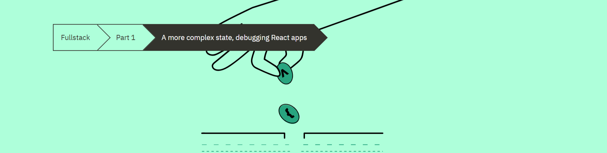

# Part 1-D: A more complex, state, debugging React apps



## Table of Contents
- [Part 1-D: A more complex, state, debugging React apps](#part-1-d-a-more-complex-state-debugging-react-apps)
  - [Table of Contents](#table-of-contents)
  - [Complex state](#complex-state)
  - [Handling Arrays](#handling-arrays)
  - [Conditional Rendering](#conditional-rendering)
  - [Debugging React Applications](#debugging-react-applications)
    - [Rules To Keep In Mind When Debugging](#rules-to-keep-in-mind-when-debugging)
    - [Example of Print-Based Debugging](#example-of-print-based-debugging)
    - [Debugger](#debugger)
  - [Rules Of Hooks](#rules-of-hooks)
  - [Event Handling Revisited](#event-handling-revisited)
    - [Examples Of Why We Only Use Functions For `onClick` Attribute With React Components](#examples-of-why-we-only-use-functions-for-onclick-attribute-with-react-components)
      - [Example 1 - Passing A String to `onClick` (Result: Error)](#example-1---passing-a-string-to-onclick-result-error)
      - [Example 2 - Passing A Number To `onClick`  (Result: Error)](#example-2---passing-a-number-to-onclick--result-error)
      - [Example 3 - direct method call  (Result: Nothing Happens)](#example-3---direct-method-call--result-nothing-happens)
        - [Why `onClick={console.log('clicked the button')}` won't work](#why-onclickconsolelogclicked-the-button-wont-work)
      - [Example 4 - direct function call  (Result: Infinite Recursion Error)](#example-4---direct-function-call--result-infinite-recursion-error)
        - [Why `onClick={setValue(0)}` won't work](#why-onclicksetvalue0-wont-work)
      - [Example 5 - Wrapping Functions In Another Function Declaration  (Result: Success!!!)](#example-5---wrapping-functions-in-another-function-declaration--result-success)
        - [Event Handler Best-Practices](#event-handler-best-practices)
  - [Function That Returns a Function](#function-that-returns-a-function)
  - [Passing Event Handlers to Child Components](#passing-event-handlers-to-child-components)
  - [Do Not Define Components Within Components](#do-not-define-components-within-components)
  - [Summary](#summary)
  - [Additional Resources](#additional-resources)


## Complex state

We built a counter using state hooks. Let's more "complex" state by creating 2 independent counters:

```js
// index.js
import React, { useState } from 'react';
import ReactDOM from 'react-dom';

const App = () => {
  const [leftCounter, setLeftCounter] = useState(0;)
  const [rightCounter, setRightCounter] = useState(0);

  // handle left counter
  const handleLeftClick = () => {
    setLeftCounter(leftCounter + 1);
  }
  //handle right counter
  const handleRightClick = () => {
    setRightCounter(rightCounter + 1);
  }

  return (
    <div>
      {left}
      <button onClick={handleLeftClick}>left</button>
      <button onClick={handleRightClick}>right</button>
      {right}
    </div>
  );
}

ReactDOM.render(
  <App />, 
  document.getElementById('root')
);
```
## Handling Arrays

Now lets add an `allClicks` in the state of the `<App>` component that start off as an empty array and concats when the left or right counter was selected:
```js
const App = () => {
  const [left, setLeft] = useState(0);
  const [right, setRight] = useState(0);
  const [allClicks, setAll] = useState([]);

  const handleLeftClick = () => {   
    // L is added to allClick  
    setAll(allClicks.concat('L')) ;  
    // count for left is incremented 
    setLeft(left + 1);  
  }
  const handleRightClick = () => {   
    // R is added to allClick 
    setAll(allClicks.concat('R')); 
    // count for right is incremented 
    setRight(right + 1)  ;
  }

  return (
    <div>
      {left}
      <button onClick={handleLeftClick}>left</button>
      <button onClick={handleRightClick}>right</button>
      {right}
      {/* We join the array and put a space between each element*/}
      <p>{allClicks.join(' ')}</p>    </div>
  );
}
```

The `allClicks` state is put onto the page and the `.join` method will return the array in string form.

**Note:** The state of React components like `allClicks` must not be mutated directly. So do not use the array method `.push()`. Instead follow the example `.concat` method because it returns a new array.

## Conditional Rendering

Now we will add a `<History>` component and rendering a default message when the  `allClicks` array is empty:

```js
const History = (props) => {
  if (props.allClicks.length === 0) {
    return (
      <div>
        the app is used by pressing the buttons
      </div>
    )
  }

  return (
    <div>
      button press history: {props.allClicks.join(' ')}
    </div>
  )
}

const Button = ({ onClick, text }) => (  
  <button onClick={onClick}>{text}</button>
);

const App = () => {
  const [left, setLeft] = useState(0)
  const [right, setRight] = useState(0)
  const [allClicks, setAll] = useState([])

  const handleLeftClick = () => {
    setAll(allClicks.concat('L'))
    setLeft(left + 1)
  }

  const handleRightClick = () => {
    setAll(allClicks.concat('R'))
    setRight(right + 1)
  }

  return (
    <div>
      {left}
      <Button onClick={handleLeftClick} text='left' />
      <Button onClick={handleRightClick} text='right' />      
      {right}
      <History allClicks={allClicks} />
    </div>
  )
}
```

Now when the `allClicks` state is an empty array, it will render:

```html
<div>the app is used by pressing the buttons</div>
```

And in all other cases:

```js
<div>
  button press history: {props.allClicks.join(' ')}
</div>
```

## Debugging React Applications

A shockingly large part of a typical developer's time is spent on debugging and reading existing code. Thankfully, React is an extremely developer-friendly library when it comes to debugging

### Rules To Keep In Mind When Debugging

**KEEP THE BROWSER'S DEVELOPER CONSOLE OPEN AT ALL TIMES**

**IDEALLY YOU WILL HAVE BOTH YOUR CODE AND THE BROWSER OPEN AND TOGETHER AT THE SAME TIME**

**WHEN THE CODE BREAKS, FIND AND FIX THE ERROR IMMEDIATELY**

### Example of Print-Based Debugging

If your component is written like this:

```js
const Button = ({ onClick, text }) => (
  <button onClick={onClick}>
    {text}
  </button>
)
```

If the `<Button>` component is not working as intended, you can revert the destructed object and log the props to the console like so:

```js
const Button = (props) => { 
  console.log(props)  
  const { onClick, text } = props

  return (
    <button onClick={onClick}>
      {text}
    </button>
  );
}
```

**NOTE:** **DO NOT** use string concatenation for props/state when logging to console:

```js
// Incorrect
console.log('props value is ' + props) // prints props value is [Object object]
```

Instead separate your values with a comma

```js
// Correct
console.log('props value is', props) 
```

### Debugger

Logging to the console is by no means the only way of debugging our applications. You can pause the execution of your application code in the Chrome developer console's [debugger](https://developer.mozilla.org/en-US/docs/Web/JavaScript/Reference/Statements/debugger), by writing the command debugger anywhere in your code.

## Rules Of Hooks

Let's be aware of some rules with hooks. `useState` and `useEffect` (which is also a hook) cannot be called in the following places:

* From inside a loop
* A conditional expression
* Any place that is not a function defining a component.


If you place hooks in any of these places, the application will behave erratically.

Here are a few visual examples

```js
const App = () => {
  // Acceptable
  const [age, setAge] = useState(0)
  const [name, setName] = useState('Juha Tauriainen')

  if ( age > 10 ) {
    // this does not work!
    const [foobar, setFoobar] = useState(null)
  }

  for ( let i = 0; i < age; i++ ) {
    // also this is not good
    const [rightWay, setRightWay] = useState(false)
  }

  const notGood = () => {
    // and this is also illegal
    const [x, setX] = useState(-1000)
  }

  return (
    //...
  )
}
```

## Event Handling Revisited

Let's start with this example:

```js
const App = () => {
  const [value, setValue] = useState(10)

  return (
    <div>
      {value}
      <button>reset to zero</button>
    </div>
  )
}

ReactDOM.render(
  <App />, 
  document.getElementById('root')
)
```

What we want is to reset the state called `value` when the button is clicked.

**Note:** Event handlers must always be a function or a reference to a function. The button will not work if the event handler is set to a variable of any other type.

### Examples Of Why We Only Use Functions For `onClick` Attribute With React Components


#### Example 1 - Passing A String to `onClick` (Result: Error)

Here is an attempt to pass a string value, which will not work:

```js
<button onClick="stuff...">button</button>
```

Since this is not a function, we would see the following error in the console:

```js
index.js:2178 Warning: Expected `onClick` listener to be a
function, instead got a value of `string` type.
    in button (at index.js:20)
    in div (at index.js:18)
    in App (at index.js:27)
```

#### Example 2 - Passing A Number To `onClick`  (Result: Error)

Trying to pass a variable and using an arithmetic expression will also not work:

```js
<button onClick={value + 1}>button</button>
```

Since this is not a function, we would see the following error in the console:

```js
index.js:2178 Warning: Expected `onClick` listener to be a
function, instead got a value of `number` type.
```

#### Example 3 - direct method call  (Result: Nothing Happens)

Now let's see what happens here

```js
<button onClick={console.log('clicked the button')}>
  button
</button>
```

The result will be the 'clicked the button' will be logged when the component renders, but nothing will happen when you click the button.

##### Why `onClick={console.log('clicked the button')}` won't work

Again, the `console.log` will run when the component is rendered because the () tied to the `console.log` tells javascript to run it.

The `onClick` within the `<button>` (event handler) is defined as a function call and assigns the returned value from the function. The return value will be `undefined` because that's what `console.log` returns. Since we are returning `undefined`, the `<button>` will not run any `console.log` request after the initial call. So nothing will happen when you click the button.

#### Example 4 - direct function call  (Result: Infinite Recursion Error)

This will not work either

```js
<button onClick={setValue(0)}>button</button>
```

##### Why `onClick={setValue(0)}` won't work

This function will run when the component renders, which will update the state and cause a re-render. When it re-renders it will run the `setValue` and set the state to 0, which will cause a re-render. This is an example of infinite recursion. It's just going to get stuck in an infinite loop.

#### Example 5 - Wrapping Functions In Another Function Declaration  (Result: Success!!!)

This is how we can get a successful `console.log` and `setValue` on the button click:

```js
// Correct
<button onClick={() => console.log('clicked the button')}>
  button
</button>
// Correct
<button onClick={() => setValue(0)}>button</button>
```

Now no function is run on render, but the reference is store to the function that has what we want. And that gets called only when the button is clicked.

##### Event Handler Best-Practices

You'll likely see event handlers defined in the Component function before returning JSX. You'll see `handleClick` is the common name of the function which will be tied to the `onclick` attribute like so:

```js
const App = () => {
  const [value, setValue] = useState(10)

  // the event handler function
  const handleClick = () =>
    console.log('clicked the button')

  return (
    <div>
      {value}
      {/* Since we have declared the function above */}
      {/* This will only run when this button is clicked */}
      <button onClick={handleClick}>button</button>
    </div>
  )
}
```

## Function That Returns a Function

## Passing Event Handlers to Child Components

## Do Not Define Components Within Components

## Summary

## Additional Resources