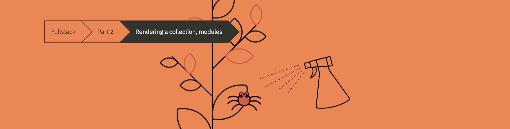
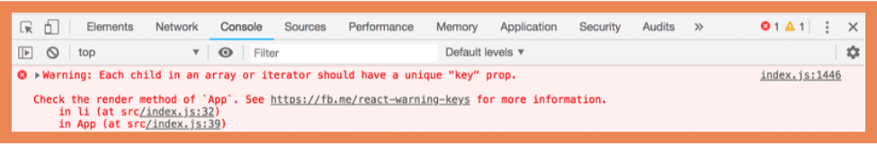

# Part 2-A: Rendering Collections and Modules



## Table of Contents

- [Part 2-A: Rendering Collections and Modules](#part-2-a-rendering-collections-and-modules)
  - [Table of Contents](#table-of-contents)
  - [1. Recap](#1-recap)
    - [1.a Console.log](#1a-consolelog)
    - [1.b JavaScript Arrays](#1b-javascript-arrays)
  - [2. Rendering Collections](#2-rendering-collections)
    - [2.a Key-attribute](#2a-key-attribute)
    - [2.b Map](#2b-map)
    - [2.c Anti-pattern: Array Indexes As Keys](#2c-anti-pattern-array-indexes-as-keys)
  - [3. Refactoring To Modules](#3-refactoring-to-modules)
  - [4. Troubleshooting When The Application Breaks](#4-troubleshooting-when-the-application-breaks)
  - [5. Summary](#5-summary)
  - [6. Links to Resources](#6-links-to-resources)


## 1. Recap

### 1.a Console.log

`What's the difference between an experienced JavaScript programmer and a rookie? The experienced one uses console.log 10-100 times more.`

If something is not working, don't just assume the data passing through the application is all fine. A better strategy is to place `console.log` in your components before returning your render to ensure all the data (props, state, logic) is working as expected. 

You also set breakpoints with the `debugger`. The JavaScript engine pauses running the code when they see the `debugger` statement. You then the ability to run the remaining JavScript code line by line at your own pace with a controller. I have included a dev.to article that walks through a scenario with visual/code examples of using the debugger. [Here is the excellent article on debugging by Justin E. Samuels](https://dev.to/thugdebugger/dude-get-a-debugger-3ige)

### 1.b JavaScript Arrays

The examples will now be using functional JavaScript array methods like `find`, `filter`, `map`. If you are not 100% confident about how they work, you can watch the first 3 videos from the playlist [Functional Programming in JavaScript by FunFunFunction](https://www.youtube.com/playlist?list=PL0zVEGEvSaeEd9hlmCXrk5yUyqUag-n84):

* [FunFunFunction - Higher-order Functions](https://www.youtube.com/watch?v=BMUiFMZr7vk&list=PL0zVEGEvSaeEd9hlmCXrk5yUyqUag-n84)
* [FunFunFunction - Map](https://www.youtube.com/watch?v=bCqtb-Z5YGQ&list=PL0zVEGEvSaeEd9hlmCXrk5yUyqUag-n84&index=2)
* [FunFunFunction - Reduce basics](https://www.youtube.com/watch?v=bCqtb-Z5YGQ&list=PL0zVEGEvSaeEd9hlmCXrk5yUyqUag-n84&index=2)

## 2. Rendering Collections

Lets start with the following example from part 0 below:

```js
import React from 'react';
import ReactDOM from 'react-dom';

const notes = [
  {
    id: 1,
    content: 'HTML is easy',
    date: '2019-05-30T17:30:31.098Z',
    important: true
  },
  {
    id: 2,
    content: 'Browser can execute only JavaScript',
    date: '2019-05-30T18:39:34.091Z',
    important: false
  },
  {
    id: 3,
    content: 'GET and POST are the most important methods of HTTP protocol',
    date: '2019-05-30T19:20:14.298Z',
    important: true
  }
];

const App = (props) => {
  const { notes } = props;

  return (
    <div>
      <h1>Notes</h1>
      <ul>
        <li>{notes[0].content}</li>
        <li>{notes[1].content}</li>
        <li>{notes[2].content}</li>
      </ul>
    </div>
  );
}

ReactDOM.render(
  <App notes={notes} />,
  document.getElementById('root')
);
```

Every object within the `notes` array has the following properties:

* A unique id
* text content
* a datestamp
* A boolean value that notates whether the note is `important`

We can improve this component by generating the React elements from the `notes` array using the [map array method](https://developer.mozilla.org/en-US/docs/Web/JavaScript/Reference/Global_Objects/Array/map).

```js
import React from 'react';
import ReactDOM from 'react-dom';

const notes = [
  {
    id: 1,
    content: 'HTML is easy',
    date: '2019-05-30T17:30:31.098Z',
    important: true
  },
  {
    id: 2,
    content: 'Browser can execute only JavaScript',
    date: '2019-05-30T18:39:34.091Z',
    important: false
  },
  {
    id: 3,
    content: 'GET and POST are the most important methods of HTTP protocol',
    date: '2019-05-30T19:20:14.298Z',
    important: true
  }
];

const App = ({notes}) => {
  return (
    <div>
      <h1>Notes</h1>
      <ul>
        /* We are now using the array method `.map` */
        /* to render each element in the `notes` array */
        {notes.map(note => <li>{note.content}</li>)}
      </ul>
    </div>
  )
}

ReactDOM.render(
  <App notes={notes} />, 
  document.getElementById('root')
);
```

The result of the render will be similar to the part 0 example:

```html
<div>
  <h1>Notes</h1>
  <ul>
    <li>HTML is easy</li>
    <li>Browser can execute only JavaScript</li>
    <li>GET and POST are the most important methods of HTTP protocol</li>
  </ul>
</div>
```

### 2.a Key-attribute

The component example above will receive the following error in the console:



When you are using an array method to display a list of elements, each element requires a unique `key` attribute. You can [learn more about React keys here](https://reactjs.org/docs/lists-and-keys.html#keys).

So let's add a key:

```js
import React from 'react';
import ReactDOM from 'react-dom';

const notes = [
  {
    id: 1,
    content: 'HTML is easy',
    date: '2019-05-30T17:30:31.098Z',
    important: true
  },
  {
    id: 2,
    content: 'Browser can execute only JavaScript',
    date: '2019-05-30T18:39:34.091Z',
    important: false
  },
  {
    id: 3,
    content: 'GET and POST are the most important methods of HTTP protocol',
    date: '2019-05-30T19:20:14.298Z',
    important: true
  }
];

const App = ({notes}) => {
  return (
    <div>
      <h1>Notes</h1>
      <ul>
        {/* We are using the `id` property on the `notes` object for the `key` */}
        {/* since the id is unique for each note */}
        {notes.map(note => <li key={note.id}>{note.content}</li>)}
      </ul>
    </div>
  )
}

ReactDOM.render(
  <App notes={notes} />, 
  document.getElementById('root')
);
```

So now the App will render the following and the error will disappear:

```html
<div>
  <h1>Notes</h1>
  <ul>
    <li key="1">HTML is easy</li>
    <li key="2">Browser can execute only JavaScript</li>
    <li key="3">GET and POST are the most important methods of HTTP protocol</li>
  </ul>
</div>
```

React uses the key attributes of objects in an array to determine how to update the view generated by a component when the component is re-rendered. [You can learn more about it here](https://reactjs.org/docs/reconciliation.html#recursing-on-children)

### 2.b Map

Understanding the `map` array method is crucial for the rest of this course. [You can learn more about the `map` array method here](https://developer.mozilla.org/en-US/docs/Web/JavaScript/Reference/Global_Objects/Array/map)

Let's examine how the `map` array method works:

```js
const notes = [
  {
    id: 1,
    content: 'HTML is easy',
    date: '2019-05-30T17:30:31.098Z',
    important: true
  },
  {
    id: 2,
    content: 'Browser can execute only JavaScript',
    date: '2019-05-30T18:39:34.091Z',
    important: false
  },
  {
    id: 3,
    content: 'GET and POST are the most important methods of HTTP protocol',
    date: '2019-05-30T19:20:14.298Z',
    important: true
  }
];

/* .map creates a new array */
/* The elements for the new array is created from elements of the original array. */
/*  It applies the function passed as a parameter on each element of the array. */
const result = notes.map(note => note.id);
console.log(result); // prints [1,2,3]

// Here is a custom function thats runs similar to the `.map` method and returns the same result
const mapArray = (arr, func) => {
  let newArr = [];
  for (let i = 0; i < arr.length; i++) {
    newArr.push(func(arr[i]));
  }
  return newArr;
} 

const resultTwo = mapArray(notes, note => note.id)
console.log(resultTwo); // prints [1, 2, 3]
```


In the example below, each element of the `notes` array is using the following function in the parameter:

```js
note => <li key={note.id}>{note.content}</li>
```

Another way to write this is:

```js
(note) => {
  // we throw the value of the `id` and `content` key from the `notes` array of objects
  // then return the JSX element
  return <li key={note.id}>{note.content}</li>
}
```

In order to add JavasScript variables into our JSX, we must wrap them in curly braces.

**Note:** The use of curly braces will cause some headache in the beginning, but you will get used to them soon enough. The visual feedback from React is immediate.

### 2.c Anti-pattern: Array Indexes As Keys

`.map` 2nd argument is the index of the given array (arr.map((item, index) => ...)

**DO NOT USE THE `.map` INDEX FOR THE `key` ATTRIBUTE. THIS IS NOT A GOOD PRACTICE.

```js
<ul>
  {notes.map((note, i) => 
    {/* INCORRECT - BAD PRACTICE */}
    <li key={i}>
      {note.content}
    </li>
  )}
</ul>
```

[You can read more about why array indexes as keys is bad idea here](https://robinpokorny.medium.com/index-as-a-key-is-an-anti-pattern-e0349aece318)
## 3. Refactoring To Modules

Now lets refactor to create a Note component:

```js
import React from 'react'
import ReactDOM from 'react-dom'

```

## 4. Troubleshooting When The Application Breaks

## 5. Summary

## 6. Links to Resources