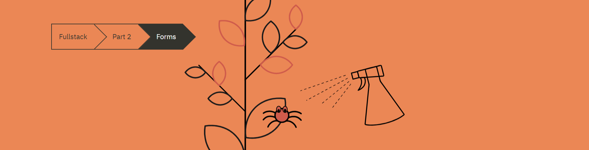

# Forms



## Table of Contents

- [Forms](#forms)
  - [Table of Contents](#table-of-contents)
  - [1. Forms](#1-forms)
  - [2. Filtering Displayed Elements](#2-filtering-displayed-elements)
  - [3. Summary](#3-summary)
  - [4. Links To Resources](#4-links-to-resources)

## 1. Forms

We will now build on our notes example from Part 2.A:

```js
// src/App.js
import React from 'react';
import Note from './components/Note'

const App = ({ notes }) => {
  return (
    <div>
      <h1>Notes</h1>
      <ul>
        {notes.map(note => <Note key={note.id} note={note} /> )}      
      </ul>
    </div>
  );
}

export default App;
```

In order to get our `<App>` to update when a new note is added, we will store our notes in the `<App>` component state. we will import the `useState` function and store the notes array stored in the `<App>` props. [You can learn more about useState here](https://reactjs.org/docs/hooks-state.html):

```js
// src/App.js
// destruct and make useState function available
import React, { useState } from 'react';
import Note from './components/Note'

const App = ({ notes }) => {
  // initialize state and pass props.notes
  const [notes, setNotes] = useState(notes);
  const 
  return (
    <div>
      <h1>Notes</h1>
      <ul>
        {notes.map(note => <Note key={note.id} note={note} /> )}      
      </ul>
    </div>
  );
}

export default App;
```

Now we will add an HTML form so we can add new notes. [You can learn more about HTML forms here](https://developer.mozilla.org/en-US/docs/Learn/HTML/Forms):

```js
import React, { useState } from 'react';
import Note from './components/Note'

const App = ({notes}) => {
  const [notes, setNotes] = useState(notes)

  // This is the vent handler that runs when the button in the <form> is clicked
  // we are passing the event object from within the <form> that holds all the information about the event (click, hover, submit, etc.)
  const addNote = (event) => {
    // we are stopping the default functionality for the <form>
    //  The default action would, among other things, cause the page to reload.
    event.preventDefault()
    // for now, we are logging the HTML element that is being clicked on
    console.log('button clicked', event.target)
  }

  return (
    <div>
      <h1>Notes</h1>
      <ul>
        {notes.map(note => 
          <Note key={note.id} note={note} />
        )}
      </ul>
      {/* Similar to onClick, onSubmit will run when the button nested in the <form> is clicked*/}
      <form onSubmit={addNote}>
        <input />
        <button type="submit">save</button>
      </form>   
    </div>
  )
}

export default App;
```

[You can learn more about learning about handling events in React here](https://reactjs.org/docs/handling-events.html)


Now we want to access the data within the `<input>` element. But how do we do that? There are many ways to do it, but the first way we will do it is by controlled components. [You can learn more about controlled components here](https://reactjs.org/docs/forms.html#controlled-components)


```js
import React, { useState } from 'react';
import Note from './components/Note'

const App = ({ notes }) => {
  const [notes, setNotes] = useState(notes);
  // We create a new state string value that will be used only by the <input> element
  const [newNote, setNewNote] = useState(
    'a new note...'
  ) ;

  const addNote = (event) => {
    event.preventDefault();
    console.log('button clicked', event.target);
  }

  // we create an event handler for when something changes in the <input> value
  // This will happen each time the user types in the <input> element
  const handleNoteChange = (event) => {
    // Notice we did not run event.preventDefault 
    // That is because there is no default action that occurs on an input change, unlike on a form submission.
    // We log the value so we can see it in the console
    console.log(event.target.value)
    // we set the new value to the newNote state
    setNewNote(event.target.value)
  }


  return (
    <div>
      <h1>Notes</h1>
      <ul>
        {notes.map(note => 
          <Note key={note.id} note={note} />
        )}
      </ul>
      <form onSubmit={addNote}>
        {/* Now newNote state will update when the user types in the <input> element */}
        <input 
          value={newNote}
          onChange={handleNoteChange}
        />
        <button type="submit">save</button>
      </form>   
    </div>
  )
}

export default App;
```

Remember to make sure you have [React Developer Tools Chrome extension](https://chrome.google.com/webstore/detail/react-developer-tools/fmkadmapgofadopljbjfkapdkoienihi) installed to see the state within the `<App>` component.

Now that we have access to input value, we can complete our `addNote` function to add to the `notes` array state:

```js
import React, { useState } from 'react';
import Note from './components/Note'

const App = ({ notes }) => {
  const [notes, setNotes] = useState(notes);
  const [newNote, setNewNote] = useState('') ;

  const addNote = (event) => {
    event.preventDefault();
    // we create a new object we will add to the `notes` array state
    // we need an id, date timestamp, boolean to note if it's important, and content text
    const noteObject = {
      id: notes.length + 1,
      content: newNote,
      date: new Date().toISOString(),
      important: Math.random() < 0.5,
    }
    // id: notes.length + 1,
      // we take the current length of the notes array (which will be the id of the last element) and add 1
      // incrementing the id will keep it unique
    // content: newNote,
      // We just take what the current state of newNote
      // This is also the current <input> value
    // date: new Date().toISOString(),
      // new Date().toISOString() creates the current datetime in string form
      // This create the timestamp we need
    // important: Math.random() < 0.5,
      // first we run Math.random which returns a floating point number between 0 and 1
      // then we compare the result to see if it is less than 0.5
      // this expression returns a boolean (true or false)

    //now we add to the `notes` state array via the concat method (concat returns a new copy of the array with the additional noteObject)
    setNotes(notes.concat(noteObject));
    // we can now reset the state value of newNote to nothing since we added the value to notes
    setNewNote('');
  }

  const handleNoteChange = (event) => {
    console.log(event.target.value)
    setNewNote(event.target.value)
  }


  return (
    <div>
      <h1>Notes</h1>
      <ul>
        {notes.map(note => 
          <Note key={note.id} note={note} />
        )}
      </ul>
      <form onSubmit={addNote}>
        <input 
          value={newNote}
          onChange={handleNoteChange}
        />
        <button type="submit">save</button>
      </form>   
    </div>
  )
}

export default App;
```

Here is an explanation on why [you never mutate state directly in React](https://reactjs.org/docs/state-and-lifecycle.html#using-state-correctly).
## 2. Filtering Displayed Elements

Now lets add a button that can toggle between all the notes and only notes marked `important`:

```js
import React, { useState } from 'react';
import Note from './components/Note'

const App = ({ notes }) => {
  const [notes, setNotes] = useState(notes);
  const [newNote, setNewNote] = useState('') ;
  // set a `showAll` state value that is a boolean
  const [ShowAll, setShowAll] = useState(true);

  // if showAll is true, return notes state array
  // if showAll is false, return notes that the `important` key has the `true` boolean value
  const notesToShow = showAll 
  ? notes 
  : notes.filter(note => note.important);

  const addNote = (event) => {
    event.preventDefault();
    const noteObject = {
      id: notes.length + 1,
      content: newNote,
      date: new Date().toISOString(),
      important: Math.random() < 0.5,
    }
    setNotes(notes.concat(noteObject));
    setNewNote('');
  }

  const handleNoteChange = (event) => {
    console.log(event.target.value)
    setNewNote(event.target.value)
  }


  return (
    <div>
      <h1>Notes</h1>
       <div>
        {/* when the button is clicked it toggles the boolean value for for showAll*/}
        {/* if showAll is true, it says `show important`*/}
        {/* If showAll is false, it says `show all` */}
        <button onClick={() => setShowAll(!showAll)}>
          show {showAll ? 'important' : 'all' }
        </button>
      </div>
      <ul>
        {/* Now we use the notesToShow variable*/}
        {notesToShow.map(note => 
          <Note key={note.id} note={note} />
        )}
      </ul>
      <form onSubmit={addNote}>
        <input 
          value={newNote}
          onChange={handleNoteChange}
        />
        <button type="submit">save</button>
      </form>   
    </div>
  )
}

export default App;
```

## 3. Summary

We can use the `<form>` HTML element, but we must include `event.preventDefault()` to stop the page from refreshing.

We can use controlled components to tie the `<input>` value to the component state to have one central location for the value. We can also pass that state value for creating/updating data within our application.


## 4. Links To Resources

* [React Docs - State hooks (useState)](https://reactjs.org/docs/hooks-state.html)
* [MDN Docs - HTML forms](https://developer.mozilla.org/en-US/docs/Learn/HTML/Forms)
* [React Docs - Handling Events](https://reactjs.org/docs/handling-events.html)
* [React Docs - Controlled Components](https://reactjs.org/docs/forms.html#controlled-component)
* [React Docs - Using State Correctly](https://reactjs.org/docs/state-and-lifecycle.html#using-state-correctly)