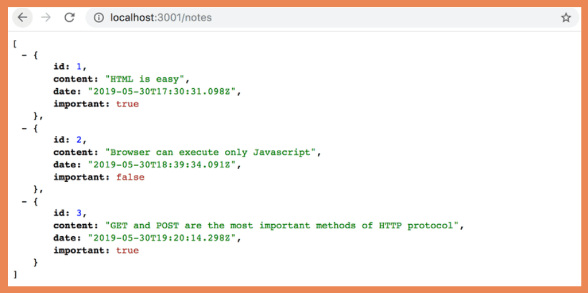
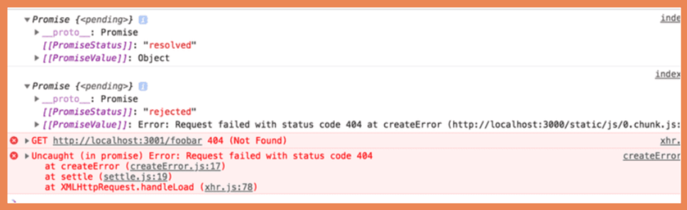
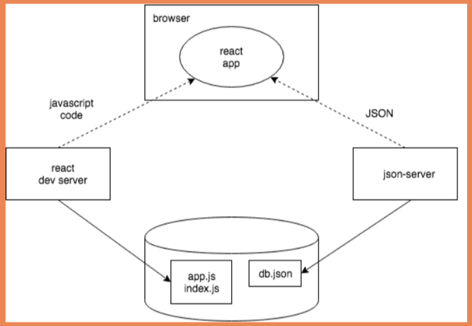

# Part 2-C: Getting Data From Servers


## Table of Contents

- [Part 2-C: Getting Data From Servers](#part-2-c-getting-data-from-servers)
  - [Table of Contents](#table-of-contents)
  - [1. Setup JSON](#1-setup-json)
  - [2. The Browser As A Runtime environment](#2-the-browser-as-a-runtime-environment)
  - [3. npm](#3-npm)
  - [4. Axios and Promises](#4-axios-and-promises)
  - [5. Effect-hooks](#5-effect-hooks)
  - [6. The Development Runtime Environment](#6-the-development-runtime-environment)
    - [6.a Front-End](#6a-front-end)
    - [6.b Back-End](#6b-back-end)
  - [7. Summary](#7-summary)
  - [8. Additional Resources](#8-additional-resources)

## 1. Setup JSON

We will be working on back-end principles in part 3. For now we will use [JSON Server npm package](https://github.com/typicode/json-server) to create a mock REST API.

First, we will create a `db.json` file in the root of our directory and then add the following contents:

```js
// db.json
{
  "notes": [
    {
      "id": 1,
      "content": "HTML is easy",
      "date": "2019-05-30T17:30:31.098Z",
      "important": true
    },
    {
      "id": 2,
      "content": "Browser can execute only JavaScript",
      "date": "2019-05-30T18:39:34.091Z",
      "important": false
    },
    {
      "id": 3,
      "content": "GET and POST are the most important methods of HTTP protocol",
      "date": "2019-05-30T19:20:14.298Z",
      "important": true
    }
  ]
}
```

now we need to implement the `json-server`, point it to the `db,json` file, and run the server. We can do this two ways in the terminal:

1. `npm install -g json-server`: This will make `json-server` will install the npm package globally. Now we can run `npm json-server --port 3001 --watch db.json` in the root directory of our project
2. `npx json-server --port 3001 --watch db.json` does not require a global install. It will find the package in npm, and run it.

**NOTE:** We are specifying `--port 3001` because the default is port 3000. Port 3000 is currently being used by your React application (via `create-react-app`).

After running `json-server` in your terminal, you should be able to visit [http://localhost:3001/notes](http://localhost:3001/notes) and see the JSON in the browser:



**NOTE:** Make sure you have the JSONView chrome extention installed.[You can learn more about JSONView here](https://chrome.google.com/webstore/detail/jsonview/chklaanhfefbnpoihckbnefhakgolnmc)

**NOTE:** In the real world, data would be stored in some kind of database. However, json-server is a handy tool that enables the use of server-side functionality in the development phase without the need to program any of it.


## 2. The Browser As A Runtime environment

Our first task is fetching the already existing notes to our React application from the address http://localhost:3001/notes. We can do this in JavaScript with the fetch method. [You can learn more about fetch here](https://developer.mozilla.org/en-US/docs/Web/API/WindowOrWorkerGlobalScope/fetch). The fetch methods relies on JavaScript promises. [You can learn more about the JavaScript promise here](https://developer.mozilla.org/en-US/docs/Web/JavaScript/Reference/Global_Objects/Promise)

JavaScript Engines follows an `asynchronous model`. [Learn more about the asynchronous model (Event Loop) here](https://developer.mozilla.org/en-US/docs/Web/JavaScript/EventLoop). This means the engine continues to run code after calling a input/output (i/o) operation, rather than waiting for the i/o operation that was just called to be returned. We can call this non-blocking input/output execution.

After its completion of the operation, the JavaScript engine calls the event handlers registered to completed operation.

JavaScript engines is also `single-threaded`, meaning it cannot execute multiple lines at the same time. It goes line by line. As a result, we need to apply the asynchronous model for input/output operations. If we don't, the browser would basically "freeze" when we tried to fetch data from another server.

If the previous paragraphs didn't make sense, don't worry. Learning what/how the browser runs JavaScript takes time. Feel free to watch [This conference talk on the event loop by Phillip Roberts](https://www.youtube.com/watch?v=8aGhZQkoFbQ). It will 
## 3. npm

We will be using the [axios npm package](https://github.com/axios/axios) for communication between the browser and server. It functions like fetch, but is somewhat more pleasant to use. Another good reason to use axios is our getting familiar with adding external libraries, so-called npm packages, to React projects.

Since we used `create-react-app` we will see a `package.json` file:

```js
// package.json
{
  "name": "notes",
  "version": "0.1.0",
  "private": true,
  "dependencies": {
    "@testing-library/jest-dom": "^4.2.4",
    "@testing-library/react": "^9.4.0",
    "@testing-library/user-event": "^7.2.1",
    "react": "^16.12.0",
    "react-dom": "^16.12.0",
    "react-scripts": "3.3.0"
  },
  "scripts": {
    "start": "react-scripts start",
    "build": "react-scripts build",
    "test": "react-scripts test",
    "eject": "react-scripts eject"
  },
  "eslintConfig": {
    "extends": "react-app"
  },
  "browserslist": {
    "production": [
      ">0.2%",
      "not dead",
      "not op_mini all"
    ],
    "development": [
      "last 1 chrome version",
      "last 1 firefox version",
      "last 1 safari version"
    ]
  }
}
```

Since we will be using axios, it is a best practice to add your npm packages in the terminal:

```bash
npm install axios
```

**NOTE:** `npm`-commands should always be run in the project root directory, which is where the package.json file can be found. For example, `npm install` will go to the `package.json` and take all the packages in `dependencies` and `devDependencies` and downloads the packages code into the `node_modules` folder. If it can't find the package.json, the  `npm install` command will return a saveError stating the `package.json` file does not exist


After installing axios via the command line, we should see this change within our `pacakge.json`:

```js
{
  //...
  "dependencies": {
    "@testing-library/jest-dom": "^4.2.4",
    "@testing-library/react": "^9.4.0",
    "@testing-library/user-event": "^7.2.1",
    "axios": "^0.19.2", // You should see this addition
    "react": "^16.12.0",
    "react-dom": "^16.12.0",
    "react-scripts": "3.3.0"
  },
  // ...
}
```

Now we are going to add the following npm package to as a `devDependencies`. [You can learn more about `json-server` here](https://www.npmjs.com/package/json-server):

```bash
npm install json-server --save-dev
```

```js
{
  //package.json
  //...
  "devDependencies": {
    "json-server": "3.3.0"
  },
  // ...
}
```

As the name suggests, these are npm packages that we will only be using while developing within this project. We are adding `json-server` to give it a JSON file and create an internal API end-point. Since we are using this to supplement a whole back-end server, this is a dependency which is only needed during the development of the project.

Rather than type in the command to run the `json-server` every time. Let's add an npm script that will do it for us:

```js
{
  //package.json
  // ... 
  "scripts": {
    "start": "react-scripts start",
    "build": "react-scripts build",
    "test": "react-scripts test",
    "eject": "react-scripts eject",
    "server": "json-server -p 3001 --watch db.json"
  },
}
```

Now when we run `npm run server`:

*  json-server will start and use the port 3001 (since create-react-app is running on 3000)
*  It looks within the root folder for a file named `db.json`.

**NOTE:** Any previously started json-server must be terminated before starting a new one. If you do not, It will scream that it can't do it's job on 3001 because the line is busy:

```
Cannot bind to the port 3001. Please specify another port number either through --port argument or through the json-server.json configuration file
```

## 4. Axios and Promises

Going forward, `json-server` is assumed to be running correctly on port 3001

**NOTE:** To run json-server and your react app simultaneously, you may need to use two terminal windows. One to keep json-server running and the other to run react-app.

The library can be brought into use the same way other libraries, e.g. React, are, i.e. by using an appropriate import statement:

```js
// src/App.js
import React, { useState } from 'react';
import Note from './components/Note';
// We are adding the axios library here and storing with the variable name `axios`
import axios from 'axios';

const App = ({ notes }) => {
  const [notes, setNotes] = useState(notes);
  const [newNote, setNewNote] = useState('') ;
  const [ShowAll, setShowAll] = useState(true);

  // We are storing the return value of axios.get to localhost:3000/notes in the variable `promise`
  const promise = axios.get('http://localhost:3001/notes');
  console.log(promise); // prints Promise {pending}

  // We are storing the return value of axios.get to localhost:3000/foobar in the variable `promise2`
  const promise2 = axios.get('http://localhost:3001/foobar')
  console.log(promise2) // prints Promise {pending}

  const notesToShow = showAll 
  ? notes 
  : notes.filter(note => note.important);

  const addNote = (event) => {
    event.preventDefault();
    const noteObject = {
      id: notes.length + 1,
      content: newNote,
      date: new Date().toISOString(),
      important: Math.random() < 0.5,
    }
    setNotes(notes.concat(noteObject));
    setNewNote('');
  }

  const handleNoteChange = (event) => {
    console.log(event.target.value);
    setNewNote(event.target.value);
  }


  return (
    <div>
      <h1>Notes</h1>
       <div>
        <button onClick={() => setShowAll(!showAll)}>
          show {showAll ? 'important' : 'all' }
        </button>
      </div>
      <ul>
        {notesToShow.map(note => 
          <Note key={note.id} note={note} />
        )}
      </ul>
      <form onSubmit={addNote}>
        <input 
          value={newNote}
          onChange={handleNoteChange}
        />
        <button type="submit">save</button>
      </form>   
    </div>
  );
}

export default App;
```

So when you go to `http://localhost:3000`, you should see this in the console:
-


Axios' method get returns a promise.

The documentation on Mozilla's site states the following about promises:

```
A Promise is an object representing the eventual completion or failure of an asynchronous operation.
```

In other words, a promise is an object that represents an asynchronous operation. A promise can have three distinct states:

1. The promise is `pending`: It means that the final value (one of the following two) is not available yet.
2. The promise is `fulfilled`: It means that the operation has completed and the final value is available, which generally is a successful operation. This state is sometimes also called `resolved`.
3. The promise is `rejected`: It means that an error prevented the final value from being determined, which generally represents a failed operation.

So the result code above is is:
 1. The variable `promise` will eventually return a `fulfilled` status (success).
 2. The variable `promise2` will be `rejected` and the error will be put in the console (error: 404 could not find `/foobar` path in the server).

We can leave instructions for what to do when the promise is `fulfilled` (success):

```js
// ...
axios.get('http://localhost:3001/notes').then(response => {
  // we can assign the variable notes an array of objects
  notes = response.data;
  console.log(response);
})
// ...
```

This will be in the console:


As you can see, with a success, the `.then` method is called. The argument is function with the parameter `response` which is an object. The `response` object contains all the data from the response of the HTTP request (`GET` in this case). You will see the following properties included in `response`:

* data
* status
* code
* headers

**NOTE:** The data returned by the server is plain text, basically just one long string. The axios library is still able to parse the data into a JavaScript array, since the server has specified that the data format is `application/json; charset=utf-8` (see previous image) using the content-type header.

This is all good, but there is a hook we can use to tie the `axios.get` with our notes state within our `<App>` component. This means we can also remove the `notes` array in our `index.js` that gets passed in the `notes` prop.

## 5. Effect-hooks

We will now implement effect-hooks into our component. You can [learn more about effect hooks here](https://reactjs.org/docs/hooks-effect.html). Per the documentation:

```
The Effect Hook lets you perform side effects in function components. Data fetching, setting up a subscription, and manually changing the DOM in React components are all examples of side effects.
```

Lets remove the `notes` variable and `notes` prop from our `index.js`

```js
// src/index.js
import React from 'react';
import ReactDOM from 'react-dom';
import App from './App';

ReactDOM.render(
  <App />,
  document.getElementById('root')
);
```

Now we will use an effect hook to fetch the `notes` from our API endpoint:

```js
// src/App.js
// We make the `useEffect` function available in our App component
import React, { useState, useEffect } from 'react';
import axios from 'axios';
import Note from './components/Note';


const App = ({ notes }) => {
  const [notes, setNotes] = useState(notes);
  const [newNote, setNewNote] = useState('') ;
  const [ShowAll, setShowAll] = useState(true);

  // Similar to componentDidMount and componentDidUpdate:
  useEffect(() => {    
    console.log('effect'); // prints 'effect' 
    // fetch an HTTP GET request to http://localhost:3001/notes 
    // and return with response object with the notes (data)
    axios
      .get('http://localhost:3001/notes')
      // response is the object with result of the GET request
      .then(response => {        
        console.log('promise fulfilled'); // prints 'promise fufilled'
        // get the notes array of objects (response.data)
        // and set that to the internal component state `notes`
        setNotes(response.data);   
    });
  }, []);
  
  console.log('render', notes.length, 'notes'); // see below

  const notesToShow = showAll 
  ? notes 
  : notes.filter(note => note.important);

  const addNote = (event) => {
    event.preventDefault();
    const noteObject = {
      id: notes.length + 1,
      content: newNote,
      date: new Date().toISOString(),
      important: Math.random() < 0.5,
    }
    setNotes(notes.concat(noteObject));
    setNewNote('');
  }

  const handleNoteChange = (event) => {
    console.log(event.target.value);
    setNewNote(event.target.value);
  }


  return (
    <div>
      <h1>Notes</h1>
       <div>
        <button onClick={() => setShowAll(!showAll)}>
          show {showAll ? 'important' : 'all' }
        </button>
      </div>
      <ul>
        {notesToShow.map(note => 
          <Note key={note.id} note={note} />
        )}
      </ul>
      <form onSubmit={addNote}>
        <input 
          value={newNote}
          onChange={handleNoteChange}
        />
        <button type="submit">save</button>
      </form>   
    </div>
  );
}

export default App;
```

If you to go console when running this code, you will see this:

```
render 0 notes
effect
promise fulfilled
render 3 notes
```

When the component is started, the length of `notes` state is empty. So:
* The `console.log` prints 'render 0 notes'
* `useEffect` is run
* The `console.log` prints 'effect'
* The axios.get function runs and returns a promise
  * The promise fulfills and runs what is in the `.then` method
    * The `console.log` prints 'promise fulfilled'
    * we set the `notes` state to `response.data`, which is the array of objects where our notes are stored
* This causes a re-render of the `<App>` component
* The `console.log` prints 'render 3 notes'

[Click here to learn more about  useEffect](https://reactjs.org/docs/hooks-reference.html#useeffect) `useEffect` takes two parameters. The first is a function, the effect itself. According to the documentation:

```
By default, effects run after every completed render, but you can choose to fire it only when certain values have changed.
```

So by default the effect is always run after the component has been rendered. In our case, however, we only want to execute the effect along with the first render.

The second parameter of useEffect is used to specify how often the effect is run. If the second parameter is an empty array [], then the effect is only run along with the first render of the component.

## 6. The Development Runtime Environment

Let's take a look at the visual workflow of our current application:



### 6.a Front-End 

* The current code in our React application is run in the browser. 
* The browser gets the JavaScript from the React dev server, which is the application that runs after running the command npm start. 
* The dev-server transforms the JavaScript into a format understood by the browser. 
* Among other things, it stitches together JavaScript from different files into one file. 
* Our React application fetches the JSON formatted data from json-server running on port 3001 on `http://localhost` (your local machine).

### 6.b Back-End

 * The server we query the data from - `json-server` - gets its data from the file db.json.

**NOTE:** At this point in development, all the parts of the application happen to reside on the software developer's machine, otherwise known as localhost. The situation changes when the application is deployed to the internet.

## 7. Summary

A common practice in React applications is fetching data from another source (server) and presenting that data within a React component. Now we can use fetch and Vanilla JS to do the same thing, so why use React? Well mainly because of the convenience of having a documented way to create web components. The React team created a way to convert a normal JavaScript function into a functional React component with "hooks" we can use to fetch data and build complex state. Most of the tools react uses is built using JavaScript (Promises, functions). Rather than build out a functionality yourself, React give you tools to add the information you want, when your application needs it. Fundamental understanding of Promises and the Event Loop will make writing React components a lot easier.

## 8. Additional Resources

* [MDN Docs - fetch](https://developer.mozilla.org/en-US/docs/Web/API/WindowOrWorkerGlobalScope/fetch) 
* [MDN Docs- JavaScript Promise](https://developer.mozilla.org/en-US/docs/Web/JavaScript/Reference/Global_Objects/Promise)
* [MDN Docs - Event Loop](https://developer.mozilla.org/en-US/docs/Web/JavaScript/EventLoop)
* [YouTube - What the heck is the event loop anyway? | Philip Roberts | JSConf EU](https://www.youtube.com/watch?v=8aGhZQkoFbQ)
* [npm - axios documentation](https://github.com/axios/axios)
* [npm - json-server documentation](https://www.npmjs.com/package/json-server)
* [React Docs - Hooks effect](https://reactjs.org/docs/hooks-effect.html)
* [React Docs - useEffect](https://reactjs.org/docs/hooks-reference.html#useeffect)
