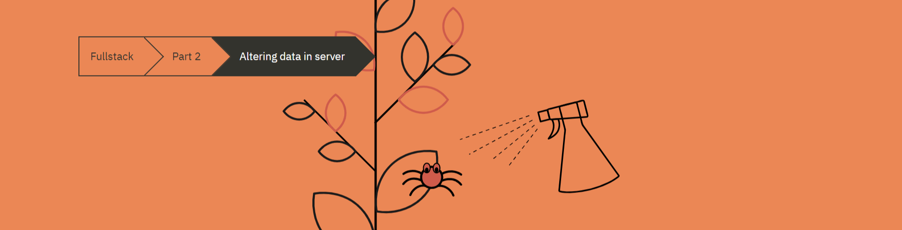

# Part 2-D: Altering Data In Server

## Table of Contents

- [Part 2-D: Altering Data In Server](#part-2-d-altering-data-in-server)
  - [Table of Contents](#table-of-contents)
  - [1. Intro](#1-intro)
  - [2. REST](#2-rest)
  - [3. Changing The Importance Of Notes](#3-changing-the-importance-of-notes)
  - [4. Extracting Communication With The Backend Into A Separate Module](#4-extracting-communication-with-the-backend-into-a-separate-module)
  - [5. Cleaner Syntax For Defining Object Literals](#5-cleaner-syntax-for-defining-object-literals)
  - [6. Promises And Errors](#6-promises-and-errors)
  - [7. Summary](#7-summary)
  - [8. Additional Resources](#8-additional-resources)

## 1. Intro

## 2. REST

## 3. Changing The Importance Of Notes

## 4. Extracting Communication With The Backend Into A Separate Module

## 5. Cleaner Syntax For Defining Object Literals

## 6. Promises And Errors

## 7. Summary

## 8. Additional Resources